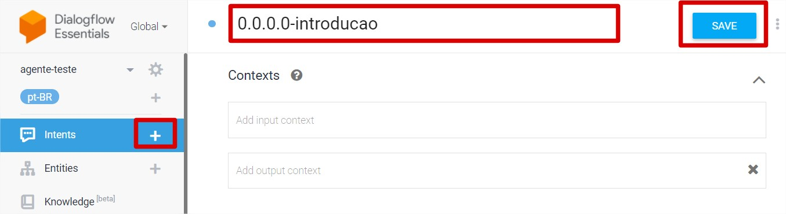
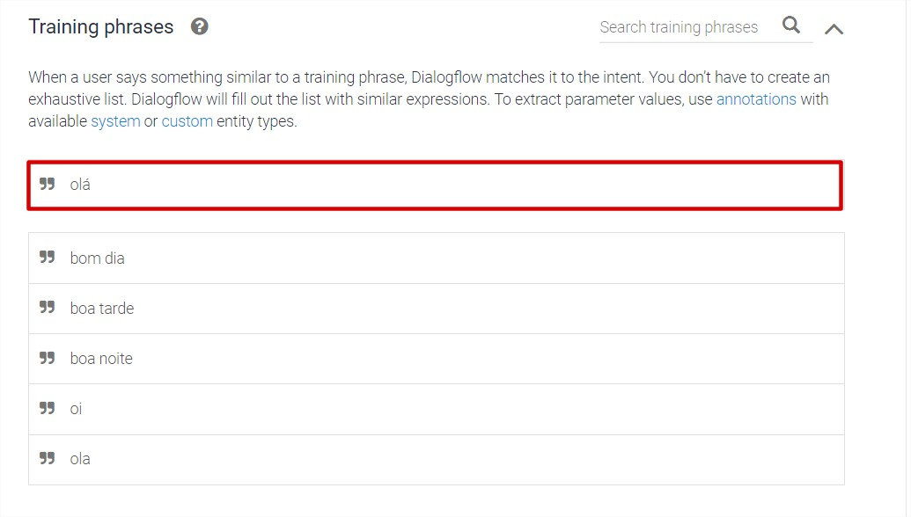
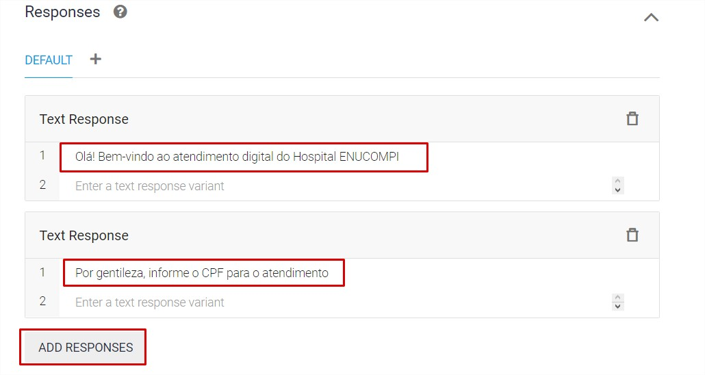
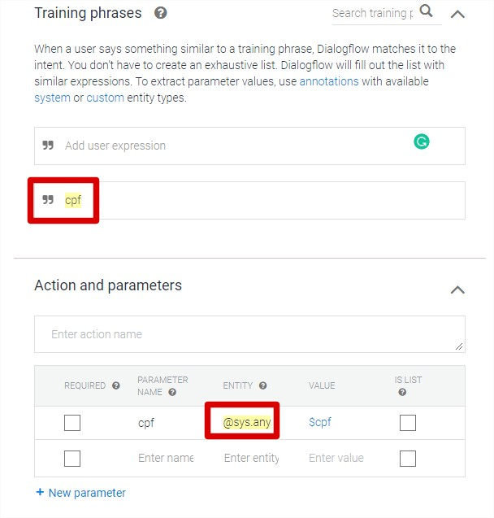
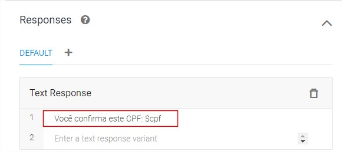
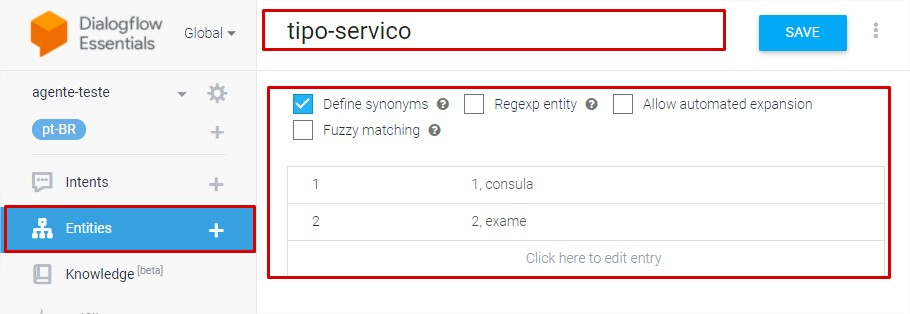
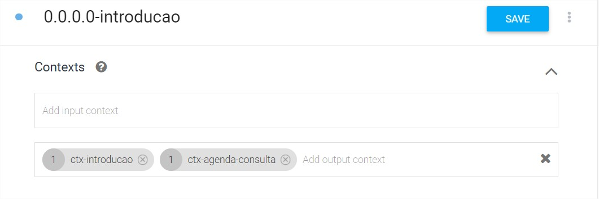
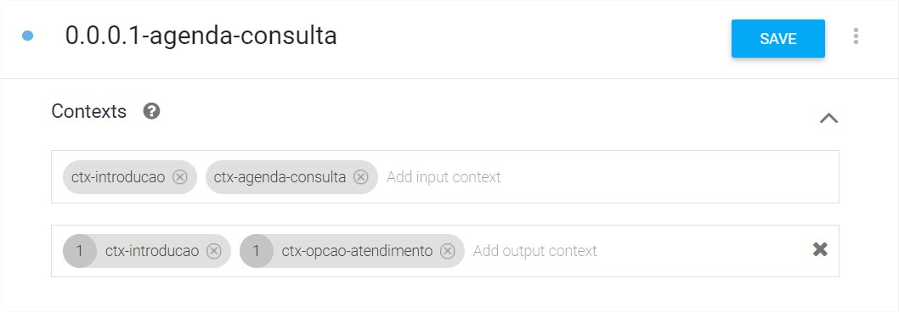
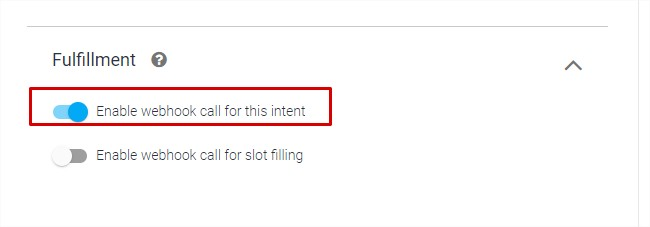
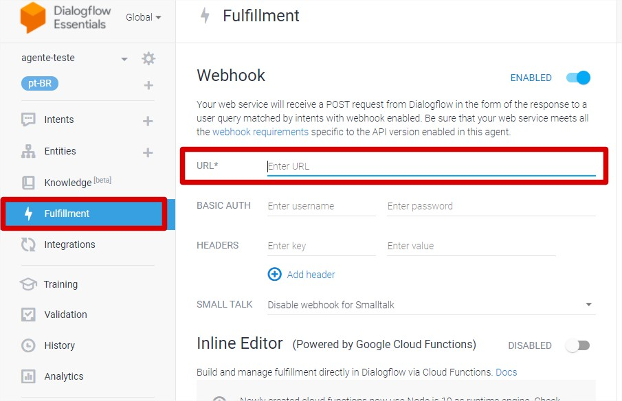

<!-- @format -->

# Desenvolvendo ChatBots com o DialogFlow

### Autores

- Joeckson Correa (Mestrando)
- Dr. Davi Viana
- Dr. Ariel Teles

## <!--[Capítulo do Livro em modo rascunho](doc/minicurso_enucompi2021.pdf)-->

### Roteiro

1. Fluxo de conversa
2. Introdução
   - Requisitos básicos
   - Principais tecnologias
3. Introdução ao Dialogflow
   - Primeiro acesso a plataforma
   - Criação do primeiro agente e suas configurações
   - Intents
   - Entidades e sinônimos de entidades
   - Definição de parâmetros
4. Contextos
   - Contextos de entrada e saída
   - Recuperação de valores em contextos
   - Encadeamento de diálogos
5. WebHook
   - Habilitar Fufillment e Webhook
   - Padrões de requisições e respostas

---

### Fluxo de conversa

Para que o ChatBot consiga ter um diálogo eficiente com o usuário, é preciso projetar o fluxo do diálogo cuidadosamente. Para criar um fluxo de dialogo, o primeiro passo é determinar o tema geral da conversa, depois determinar cada uma de suas cenas, bem como o personagem para ilustrar cada cena. Em seguida é feito um exemplo de conversa com a resposta [esperada](https://ieeexplore.ieee.org/document/9231659). O exemplo de fluxo de conversa na figura abaixo, foi criado utilizando a ferramenta de código aberto, [Twinery](https://twinery.org/).


---

### Requisitos básciso

- Ter uma conta no cadastrada no [Google](https://www.google.com/account/about/)
- Ter uma conta no [Github](https://github.com/)
- Ter instalado o [Git](https://git-scm.com/)
- Ter instalado o software [NodeJs](https://nodejs.org/en/)

---

### Tecnologias utilizadas

Abaixo temos as principais tecnologias utilizadas neste minicurso


---

### Introdução ao Dialogflow

O Dialogflow fornece aos usuário uma interface voltada para ambiente Web chamada Console Dialogflow. Este console é utilizado para criar agentes, intents, entidades, contextos. Para criar uma conta no Dialogflow é requirido uma conta do Google para realizar o login na plataforma, caso você não tenha uma conta, sera necessário criar. A abaixo apresenta a tela de acesso à plataforma.


#### Primeiro acesso a plataforma.

- Acessar o endereço da plataforma [Dialogflow](https://dialogflow.cloud.google.com/login)
- Clicar na botão `Sign-in with Google`
- Selecionar a conta de acesso

#### Criação do primeiro agente

O conceito de agente no Dialgflow, remeti-se a um agente virtual que prove conversas com usuários finais. É um módulo de PLN que entende as variações da linguagem humana através da tradução dos textos e áudios do usuário durante a conversa para dados estruturados.

Para criar um agente, siga os passos abaixo abaixo:

- Acesse o Console do Dialogflow
- Se solicitado, faça login no Console do Dialogflow
- Clique em `Criar Agente` no menu à esquerda.
- Se você já tiver outros agentes, clique no nome do agente, role até a parte inferior e clique em `Criar novo agente`.
- Digite o nome do agente, o idioma e fuso horário padrão. Depois, clique no botão `Criar`.

As figuras abaixo motram como criar um agente.


---

#### Configuração do agente

O processo abaixo explica como acessar as configurações do agente.

- Acesse o Console do Dialogflow.
- Selecione seu agente próximo à parte superior do menu da barra lateral à esquerda.
- Clique no botão de configurações ao lado do nome do agente (conforme a imagen abaixo)


###### Guia Geral

Conforme a figura abaixo, temos a guia `Geral` e nela estão disponíveis configurações como, `Description` descrição do agente. `Default Time Zone` fuso horário padrão do agente. `URI do avatar do agente` um URI para o avatar do agente usado por algumas integrações. `Projeto do Google` projeto do GCP vinculado ao agente.


###### Guia Idiomas

Para acessar as configurações de idioma, clique na guia `Language`. É possível definir o idioma padrão e vários idiomas adicionais. Para alguns idiomas raiz, também é possível adicionar uma ou mais localidades. A figura abaixo, mostra as configurações de idiomas.


###### Guia Exportar e importar

Para acessar as configurações de exportação e importação, clique na guia `Exportar e Importar`. Esse recurso permite exportar ou importar um agente para ou de um arquivo zip para fazer backup de agentes ou transferi-los de uma conta para outra. É possível editar os arquivos JSON diretamente e importá-los novamente. Tendo como configurações as opções. `Exportar como ZIP` exporta o agente como um arquivo zip. `Restaurar do ZIP` substitui o agente atual pelo arquivo zip fornecido. `Importar do ZIP` adiciona intents e entidades ao agente atual a partir do arquivo zip fornecido. Se alguma intent ou entidade tiver o mesmo nome que o arquivo zip, ela será substituída.
A figura abaixo, mostra as configurações de importação e exportação de agentes.


---

#### Criação e configuração de intenções

Nesta etapa, explica como criar, excluir, copiar e mover intenções.

- Clique no botão de adição `+` ao lado de `Intents` no menu da barra lateral à esquerda.
- Insira um nome para a `Intents`. O nome da `Intents` precisa representar as expressões de usuário final que ela reconhece. Para o ChatBot que está sendo criado, a primeira intenção será chamada de `0.0.0.0-introducao`.




##### Adicionando frazes de treinamento
- Na seção `Training phrases`, clique em `Add user expression`.
- Digite as frases de treinamento correspondentes a intenção em questão, e pressione `Enter` após cada entrada.




##### Adicionando respostas às intenções.
- Na seção , digite a resposta da intenção na seção `Text Responses`.
- Para adicionar mais de uma resposta, clique no botão `ADD RESPONSES`, e adicione as respostas desejadas.
- Após o preenchimento das respostas, clique em `Save`.



##### Adicionando parâmetro obrigatórios.

- Na seção `Training phrases`, adicione uma frase de treinamento (CPF).
- - Na tabela `Action and parameters` e parâmetros, adicone o parâmetro @sys.any.


- Na tabela `Text Response`, adicione a seguinte frase de resposta: `Você confirma este CPF: $cpf`


---

#### Criação de entidades

O processo abaixo, explica como criar entidades.

- Clique em `Create entity`.
- Insira um nome para a entidade.
- Observe que a opção `Define synonyms` já está marcada.
- Clique na primeira linha e forneça um valor de referência na coluna esquerda.
- Clique na próxima coluna ou pressione `Enter` e forneça sinônimos.
- Continue adicionando linhas para outras entradas de entidade.
- Clique em `Save`.


---

### Contextos

No Dialogflow é utilizado contextos para controlar o fluxo de uma conversa, sua configuração é feita dentro de uma intenção informando seus respectivos contextos de entrada e saída. Quando uma intenção é correspondida, todos os contextos de saída configurados para essa intenção são ativados. Embora os contextos estejam ativos, é mais provável que o Dialogflow corresponda às intenções configuradas com contextos de entrada correspondentes aos contextos ativos no momento.

- Selecione uma `intent`.
- Selecione a opção `Contexts`.
- Clique na opção `ADD CONTEXT`.
- No campo `Add input context`, adicione o contexto de entrada.
- No campo `Add output context`, adicione o contexto de saída.
- Clique no botão `Salvar`.


##### Encadeamento de conversa
- Selecione a intenção `0.0.0.0-introducao`.
- Selecione a opção `Contexts`.
- No campo `Add output context`, adicione os contextos de saída `ctx-introducao` e `ctx-agenda-consulta`.
- Clique no botão `Salvar`.
- Selecione a intenção ``0.0.0.1-agenda-consulta`.
- No campo `Add input context`, adicione os contextos de entrada `ctx-introducao` e `ctx-agenda-consulta`;
- No campo `Add output context`, adicione os contextos de saída `ctx-introducao` e `ctx-opcao-atendimento`.
- Clique no botão `Salvar`.



---

### WebHook

Nesta seção é apresentado como o Dialogflow fornece respostas aos usuário através de um serviço de back-end `(WebHook)`, destacamos que não iremos aprofundarmos nas explicações dos conceitos e funcionalidade de `WebHook` e `Fulfillment`.

-  Clique na intenção que será utilizada como `Fulfillment`.
-  Na seção `Fulfillment`, clique no botão `Enable webhook call fot this intent` chamada de webhook para essa intenção.
-  Clique no botão `Salvar`.


##### Habilitar Webhook.

- Clique na guia `Fulfillment` na barra de navegação para acessar a página de fulfillment.
- Alterne o botão do `Webhook` para `Enable`.
- No campo `URL` insira o endereço do webhook.
-  Clique no botão `Salvar`.



### Exemplo de solicitação e resposta
##### WebhookRequest

```
{
  "responseId": "response-id",
  "session": "projects/project-id/agent/sessions/session-id",
  "queryResult": {
    "queryText": "End-user expression",
    "parameters": {
      "param-name": "param-value"
    },
    "allRequiredParamsPresent": true,
    "fulfillmentText": "Response configured for matched intent",
    "fulfillmentMessages": [
      {
        "text": {
          "text": [
            "Response configured for matched intent"
          ]
        }
      }
    ],
    "outputContexts": [
      {
        "name": "projects/project-id/agent/sessions/session-id/contexts/context-name",
        "lifespanCount": 5,
        "parameters": {
          "param-name": "param-value"
        }
      }
    ],
    "intent": {
      "name": "projects/project-id/agent/intents/intent-id",
      "displayName": "matched-intent-name"
    },
    "intentDetectionConfidence": 1,
    "diagnosticInfo": {},
    "languageCode": "en"
  },
  "originalDetectIntentRequest": {}
}
```


#### Webhook Response

```
{
  "fulfillmentMessages": [
    {
      "text": {
        "text": [
          "Text response from webhook"
        ]
      }
    }
  ]
}

```

Consulte a documentação oficial do Dialogflow para mais informações:
- [Resquest](https://cloud.google.com/dialogflow/es/docs/reference/common-types#webhookrequest)
- [Response](https://cloud.google.com/dialogflow/es/docs/reference/common-types#webhookresponse)
 


