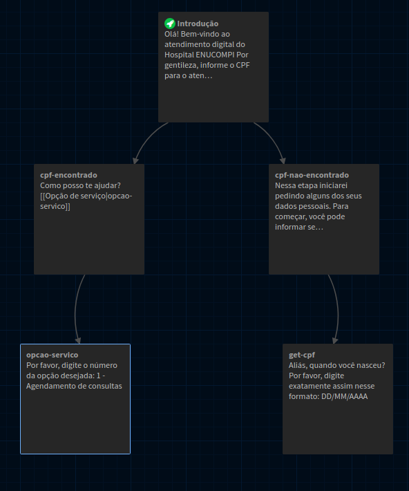
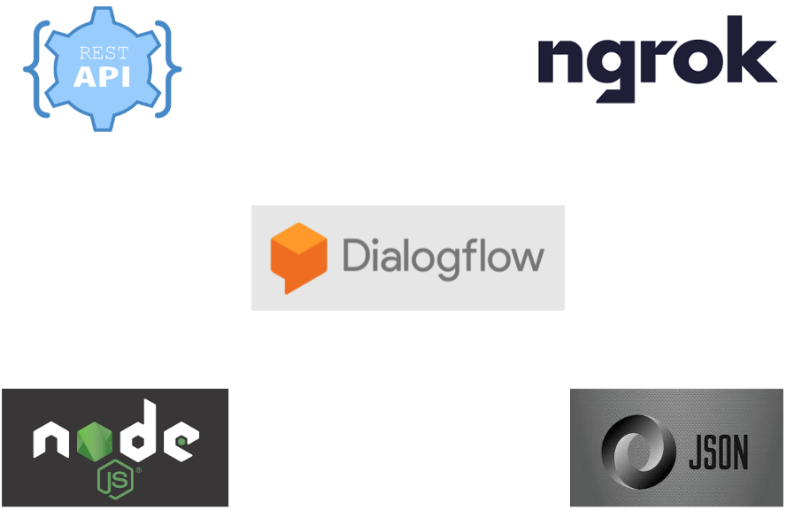

<!-- @format -->

# Desenvolvendo ChatBots com o DialogFlow

### Autores

- Joeckson Correa
- Davi Viana
- Ariel Teles

## <!--[Capítulo do Livro em modo rascunho](doc/minicurso_enucompi2021.pdf)-->

### Roteiro

1. Fluxo de conversa
2. Introdução
   - Requisitos básicos
   - Principais tecnologias
3. Introdução ao Dialogflow
   - Criação do primeiro agente e suas configurações
   - Intents, Welcome Intents, Fallback Intents
   - Entidades e sinônimos de entidades
   - Definição de parâmetros
4. Contextos
   - Contextos de entrada e saída
   - Recuperação de valores em contextos
   - Encadeamento de diálogos
   - Follow-up Intents
5. WebHook
   - WebHooks e arquiteturas para integração com agentes do DialogFlow
   - Padrões de requisições e respostas
   - Fornecimento de respostas via código-fonte

---

### Fluxo de conversa

Para que o ChatBot consiga ter um diálogo eficiente com o usuário, é preciso projetar o fluxo do diálogo cuidadosamente. Para criar um fluxo de dialogo, o primeiro passo é determinar o tema geral da conversa, depois determinar cada uma de suas cenas, bem como o personagem para ilustrar cada cena. Em seguida é feito um exemplo de conversa com a resposta [esperada](https://ieeexplore.ieee.org/document/9231659). O exemplo de fluxo de conversa na figura abaixo, foi criado utilizando a ferramenta de código aberto, [Twinery](https://twinery.org/).

---

### Requisitos básciso

- Ter uma conta no cadastrada no [Google](https://www.google.com/account/about/)
- Ter uma conta no [Github](https://github.com/)
- Ter instalado o [Git](https://git-scm.com/)
- Ter instalado o software [NodeJs](https://nodejs.org/en/)

---

### Tecnologias utilizadas

Abaixo temos as principais tecnologias utilizadas neste minicurso

