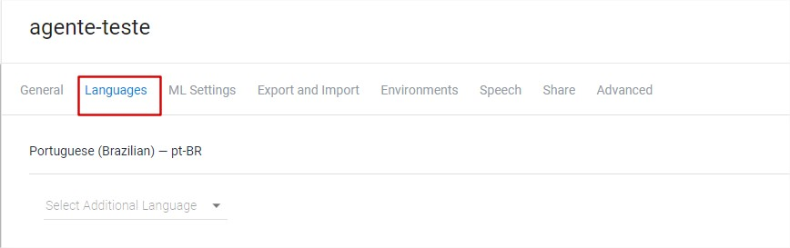

<!-- @format -->

# Desenvolvendo ChatBots com o DialogFlow

### Autores

- Joeckson Correa
- Davi Viana
- Ariel Teles

## <!--[Capítulo do Livro em modo rascunho](doc/minicurso_enucompi2021.pdf)-->

### Roteiro

1. Fluxo de conversa
2. Introdução
   - Requisitos básicos
   - Principais tecnologias
3. Introdução ao Dialogflow
   - Primeiro acesso a plataforma
   - Criação do primeiro agente e suas configurações
   - Intents, Welcome Intents, Fallback Intents
   - Entidades e sinônimos de entidades
   - Definição de parâmetros
4. Contextos
   - Contextos de entrada e saída
   - Recuperação de valores em contextos
   - Encadeamento de diálogos
   - Follow-up Intents
5. WebHook
   - WebHooks e arquiteturas para integração com agentes do DialogFlow
   - Padrões de requisições e respostas
   - Fornecimento de respostas via código-fonte

---

### Fluxo de conversa

Para que o ChatBot consiga ter um diálogo eficiente com o usuário, é preciso projetar o fluxo do diálogo cuidadosamente. Para criar um fluxo de dialogo, o primeiro passo é determinar o tema geral da conversa, depois determinar cada uma de suas cenas, bem como o personagem para ilustrar cada cena. Em seguida é feito um exemplo de conversa com a resposta [esperada](https://ieeexplore.ieee.org/document/9231659). O exemplo de fluxo de conversa na figura abaixo, foi criado utilizando a ferramenta de código aberto, [Twinery](https://twinery.org/).

---

### Requisitos básciso

- Ter uma conta no cadastrada no [Google](https://www.google.com/account/about/)
- Ter uma conta no [Github](https://github.com/)
- Ter instalado o [Git](https://git-scm.com/)
- Ter instalado o software [NodeJs](https://nodejs.org/en/)

---

### Tecnologias utilizadas

Abaixo temos as principais tecnologias utilizadas neste minicurso

---

### Introdução ao Dialogflow

O Dialogflow fornece aos usuário uma interface voltada para ambiente Web chamada Console Dialogflow. Este console é utilizado para criar agentes, intents, entidades, contextos. Para criar uma conta no Dialogflow é requirido uma conta do Google para realizar o login na plataforma, caso você não tenha uma conta, sera necessário criar. A abaixo apresenta a tela de acesso à plataforma.

##### Primeiro acesso a plataforma.

- Acessar o endereço da plataforma [Dialogflow](https://dialogflow.cloud.google.com/login)
- Clicar na botão `Sign-in with Google`
- Selecionar a conta de acesso

##### Criação do primeiro agente

O conceito de agente no Dialgflow, remeti-se a um agente virtual que prove conversas com usuários finais. É um módulo de PLN que entende as variações da linguagem humana através da tradução dos textos e áudios do usuário durante a conversa para dados estruturados.

Para criar um agente, siga os passos abaixo abaixo:

- Acesse o Console do Dialogflow
- Se solicitado, faça login no Console do Dialogflow
- Clique em `Criar Agente` no menu à esquerda.
- Se você já tiver outros agentes, clique no nome do agente, role até a parte inferior e clique em `Criar novo agente`.
- Digite o nome do agente, o idioma e fuso horário padrão. Depois, clique no botão `Criar`.

As figuras abaixo motram como criar um agente.

---

##### Configuração do agente

O processo abaixo explica como acessar as configurações do agente.

- Acesse o Console do Dialogflow.
- Selecione seu agente próximo à parte superior do menu da barra lateral à esquerda.
- Clique no botão de configurações ao lado do nome do agente (conforme a imagen abaixo)

- Guia Geral
  Conforme a figura abaixo, temos a guia `Geral` e nela estão disponíveis configurações como, `Description` descrição do agente. `Default Time Zone` fuso horário padrão do agente. `URI do avatar do agente` um URI para o avatar do agente usado por algumas integrações. `Projeto do Google` projeto do GCP vinculado ao agente.

- Guia Idiomas
  Para acessar as configurações de idioma, clique na guia `Language`. É possível definir o idioma padrão e vários idiomas adicionais. Para alguns idiomas raiz, também é possível adicionar uma ou mais localidades. A figura abaixo, mostra as configurações de idiomas.
  

- Guia Exportar e importar
  Para acessar as configurações de exportação e importação, clique na guia `Exportar e Importar`. Esse recurso permite exportar ou importar um agente para ou de um arquivo zip para fazer backup de agentes ou transferi-los de uma conta para outra. É possível editar os arquivos JSON diretamente e importá-los novamente. Tendo como configurações as opções. `Exportar como ZIP` exporta o agente como um arquivo zip. `Restaurar do ZIP` substitui o agente atual pelo arquivo zip fornecido. `Importar do ZIP` adiciona intents e entidades ao agente atual a partir do arquivo zip fornecido. Se alguma intent ou entidade tiver o mesmo nome que o arquivo zip, ela será substituída.
  A figura abaixo, mostra as configurações de importação e exportação de agentes.
  
